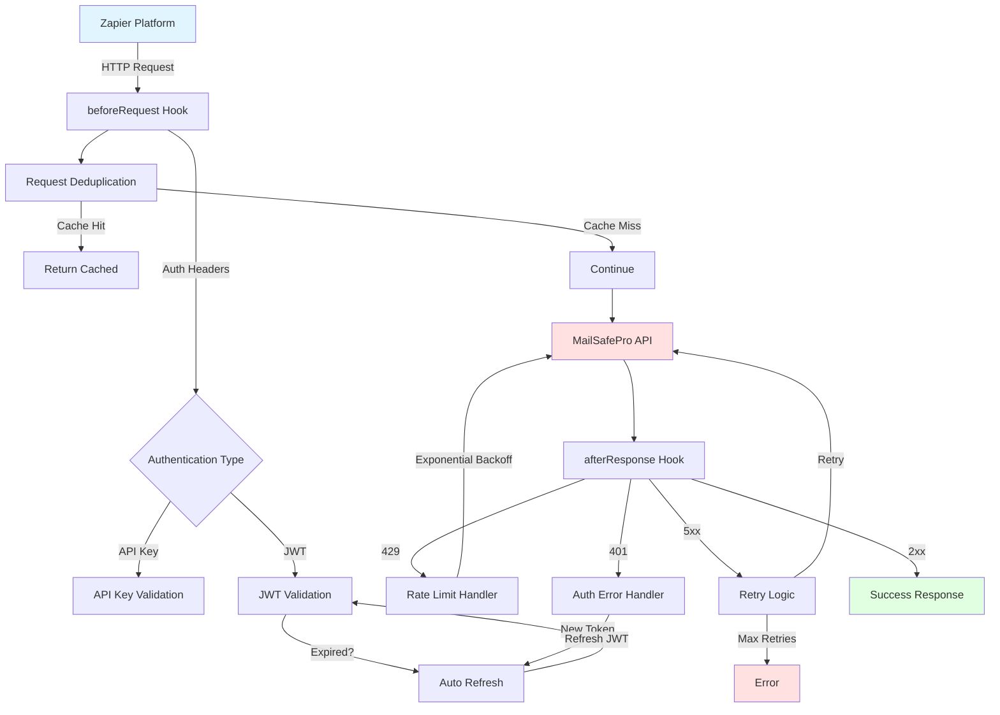
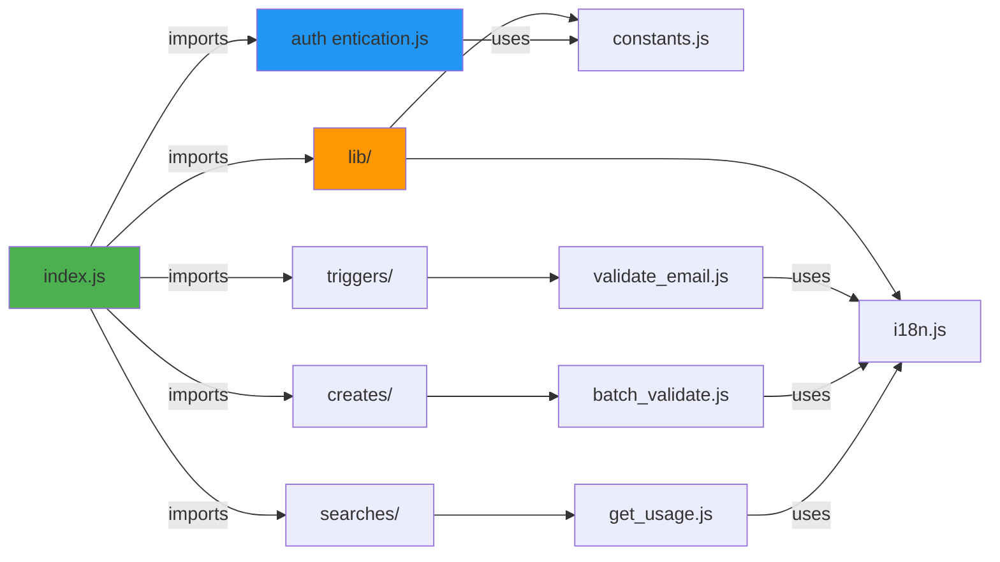
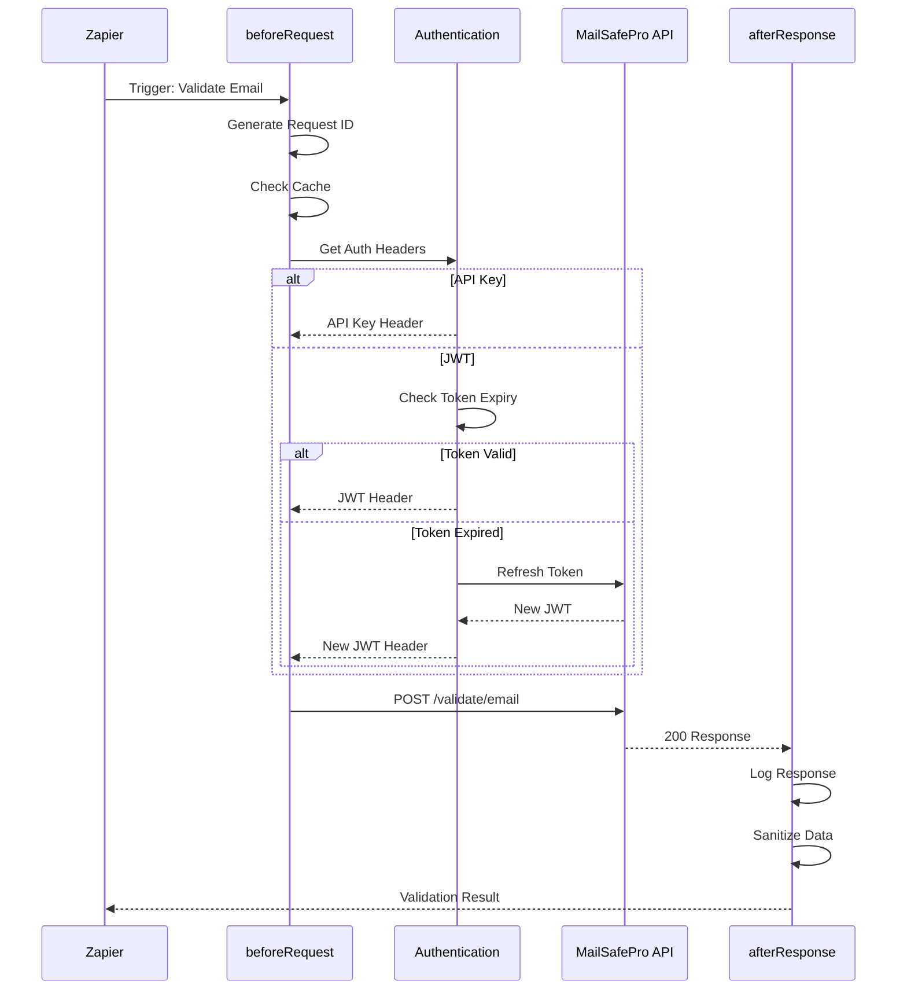
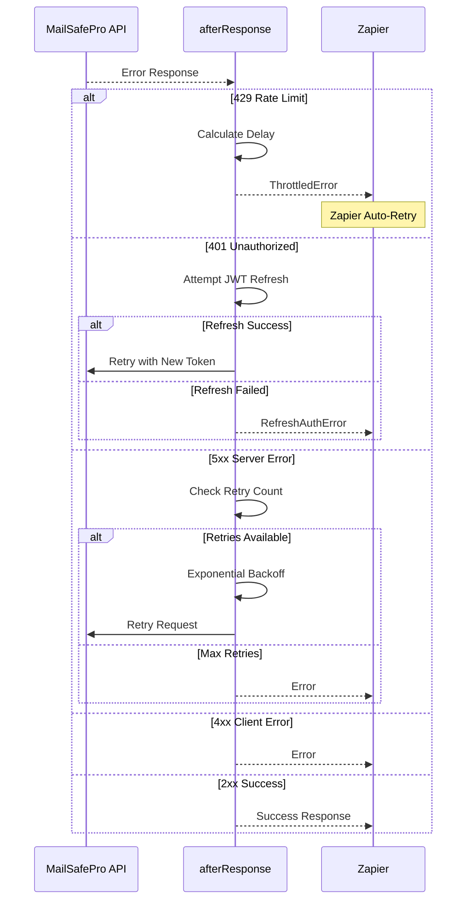
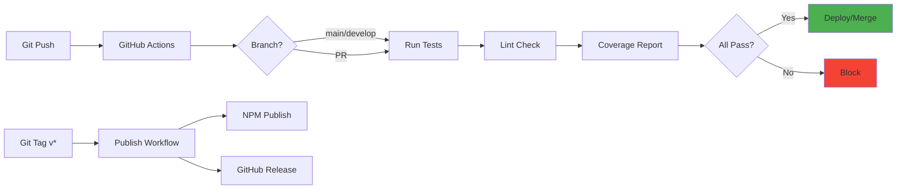

# Architecture - MailSafePro Zapier Integration

## System Overview

The MailSafePro Zapier integration is built with a modular, enterprise-grade
architecture designed for reliability, performance, and maintainability.



## Module Structure



## Request Flow

### Single Email Validation Flow



### Error Handling Flow



## Component Architecture

### Authentication Module

```
authentication.js
├── getSessionKey()       → Handles initial auth
├── refreshAccessToken()  → JWT token refresh
├── preRequest()          → Injects auth headers
├── withRetry()           → Retry logic
└── exponentialBackoff()  → Delay calculation
```

**Key Features:**

- Dual auth support (API Key + JWT)
- Automatic JWT refresh (5 min before expiry)
- Exponential backoff with jitter
- Request deduplication

### Hooks System

```
index.js
├── beforeRequest()
│   ├── Request ID generation
│   ├── Cache deduplication
│   ├── Auth header injection
│   └── Standard headers
│
└── afterResponse()
    ├── Rate limit handling (429)
    ├── Auth error handling (401)
    ├── Retry logic (5xx)
    └── Error transformation
```

### i18n System

```
lib/i18n.js
├── getCurrentLocale()    → Detect user locale
├── t(key, params)        → Translate key
├── interpolate()         → Replace {{params}}
└── getNestedValue()      → Deep object access

locales/
├── en.json              → English translations
├── es.json              → Spanish translations
└── pt.json              → Portuguese translations
```

## Data Flow

### Request Pipeline

```
User Input
    ↓
Input Validation
    ↓
beforeRequest Hook
    ├→ Request Deduplication
    ├→ Authentication Headers
    └→ Logging & Tracking
    ↓
API Request
    ↓
afterResponse Hook
    ├→ Error Classification
    ├→ Retry Logic
    ├→ Data Sanitization
    └→ Response Transformation
    ↓
Zapier Output
```

### Error Recovery Strategy

```
Error Detected
    ↓
├─ 4xx Client Error?
│   ├→ Yes → Return Error
│   └→ No → Continue
│
├─ 429 Rate Limit?
│   ├→ Yes → ThrottledError + Auto-Retry
│   └→ No → Continue
│
├─ 401 Unauthorized?
│   ├→ JWT Auth?
│   │   ├→ Yes → Attempt Refresh
│   │   │   ├→ Success → Retry Request
│   │   │   └→ Fail → RefreshAuthError
│   │   └→ No → RefreshAuthError
│   └→ No → Continue
│
└─ 5xx Server Error or Timeout?
    ├→ Retry Attempts < Max?
    │   ├→ Yes → Exponential Backoff + Retry
    │   └→ No → Return Error
    └→ Success → Return Response
```

## Performance Optimizations

### 1. Request Deduplication

- Cache window: 5 seconds
- Cache key: `method:url:body`
- Max cache size: 100 entries
- Auto-cleanup on size limit

### 2. Exponential Backoff

- Base delay: 1000ms
- Max delay: 10000ms
- Jitter: ±20% randomization
- Prevents thundering herd

### 3. JWT Token Management

- Auto-refresh 5 min before expiry
- Prevents mid-request auth failures
- Reduces API calls

## Security Architecture

### Data Protection

```
User Input
    ↓
Input Sanitization
    ↓
Encrypted Transport (TLS 1.3)
    ↓
API Processing
    ↓
Response Sanitization
    ├→ Sensitive Keys Redacted
    ├→ Long Strings Truncated
    └→ Nested Objects Sanitized
    ↓
Zapier Output
```

### Sensitive Data Handling

**Sanitized Keys:**

- password
- api_key
- token
- authorization
- refresh_token
- secret

**Logging Policy:**

- All sensitive data → `[REDACTED]`
- Request/Response bodies sanitized
- Headers excluded (except in debug)
- Max body length: 500 chars

## Testing Architecture

### Test Layers

```
Unit Tests (test/unit/)
├── authentication.test.js   → 28 tests
├── index.test.js            → 64 tests
├── validate_email.test.js   → 47 tests
├── batch_validate.test.js   → 39 tests
└── get_usage.test.js        → 30 tests

Integration Tests (test/integration/)
└── end_to_end.test.js       → 10 tests

Performance Tests (test/performance/)
└── benchmark.test.js        → Latency tests
```

### Test Coverage Goals

- **Statements**: > 92%
- **Branches**: > 80%
- **Functions**: > 98%
- **Lines**: > 92%

## Deployment Architecture

### CI/CD Pipeline



## Scalability Considerations

### Horizontal Scaling

- Stateless design
- No server-side sessions
- Cache can be distributed

### Rate Limiting

- Client-side throttling
- Exponential backoff
- Request deduplication

### Monitoring

- Structured logging
- Request ID tracking
- Performance benchmarks

## Future Enhancements

1. **Circuit Breaker Pattern**

   - Prevent cascading failures
   - Fast-fail on persistent errors

2. **Webhook Triggers**

   - Real-time event notifications
   - Batch completion callbacks

3. **Advanced Caching**

   - Redis integration
   - TTL-based invalidation

4. **Metrics Dashboard**
   - Real-time performance metrics
   - Error rate tracking
   - Usage analytics

---

**Last Updated**: 2025-01-22  
**Version**: 1.0.0  
**Maintainer**: MailSafePro Team
